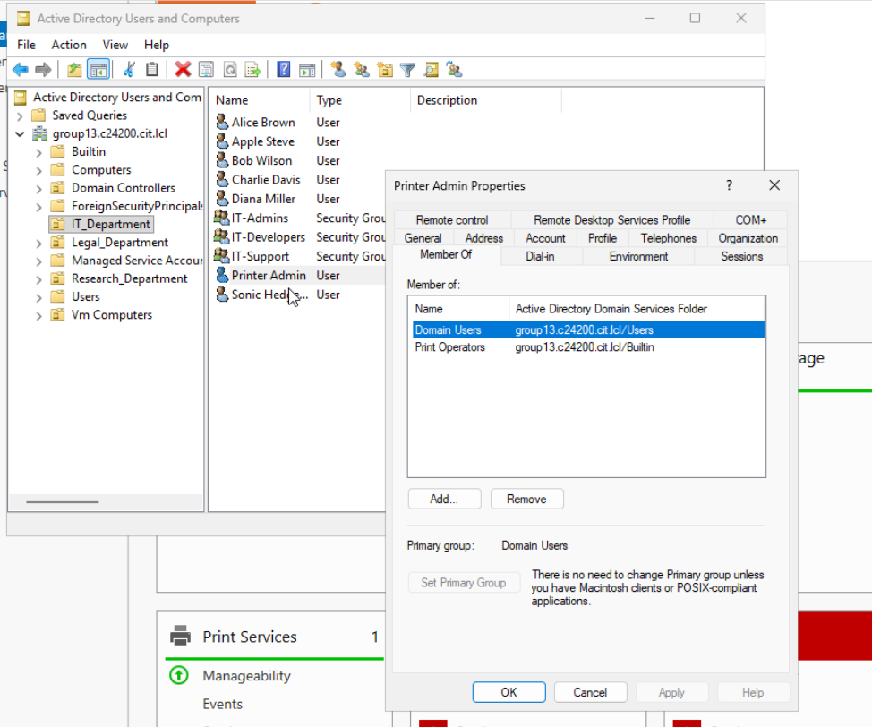

# Centralized Windows Enterprise Infrastructure Simulation

## Executive Summary
This project demonstrates the design and implementation of a centralized Windows enterprise infrastructure, simulating real-world domain operations. The environment is architected around an Active Directory (AD) core to manage identity, resource governance, remote administration, and high-availability file services.

The system emphasizes a security-first approach through role-based access control (RBAC), centralized patch management via WSUS, and headless administrative control through PowerShell Remoting, reflecting a mature, production-ready enterprise model.

## Tech Stack & Frameworks
* **Identity & Directory Services:** Active Directory (AD DS), DNS, LDAP, Kerberos
* **Remote Administration:** PowerShell Remoting (WinRM)
* **File Services:** Distributed File System (DFS-N & DFS-R)
* **Patch Management:** Windows Server Update Services (WSUS)
* **Operating Systems:** Windows Server 2022, Windows 10/11
* **Governance:** Group Policy Objects (GPO), Role-Based Access Control (RBAC)

---

## System Architecture

The infrastructure connects domain controllers, specialized resource servers, and administrative workstations within a unified AD domain. Centralized Group Policy enforcement ensures consistent security and configuration across the entire machine fleet.

  

<em>Figure 1: High-level architectural diagram showcasing domain inter-connectivity and service distribution.</em>

---

## Pillar 1: Identity Governance & Access Control

Identity management is centralized within Active Directory, utilizing a clean Organizational Unit (OU) structure to manage domain users and machines. Authentication is handled via Kerberos, with directory operations supported through LDAP.

### Role-Based Delegation (RBAC)
Instead of assigning direct, broad privileges, access is governed through membership in scoped security groups. For example, a dedicated **Printer Admin** account is restricted to managing print services through membership in the **Print Operators** group, successfully demonstrating the principle of least privilege (PoLP).

  

<em>Figure 2: Active Directory Organizational Unit (OU) design for centralized identity governance.</em>

  

<em>Figure 3: Security descriptors proving role-based delegation for resource management.</em>

---

## Pillar 2: High-Availability File Services

To ensure data availability and seamless user access, the environment utilizes Distributed File System (DFS) technologies.

* **DFS Namespace (DFS-N):** Provides a unified logical path for shared folders, allowing users to access data through the namespace rather than individual server IPs or hostnames.
* **DFS Replication (DFS-R):** Maintains data consistency across multiple backend folder targets, ensuring that if one file server fails, access continues uninterrupted.

  
   
  <b>Figure 4: DFS Namespace mapping to multiple redundant folder targets.</b>

  
   
  <b>Figure 5: Operational proof of data synchronization across the DFS replication group.</b>

---

## Pillar 3: Remote Administration & Patch Management

The infrastructure is designed for headless management, significantly reducing the need for direct local logins to servers.

### PowerShell Remoting
Administrative operations are executed remotely from a dedicated workstation using PowerShell Remoting over WinRM. This was validated by remotely managing the **Print Spooler** service on a target server without an active RDP session.

### Centralized Update Deployment (WSUS)
Patch management is centralized through Windows Server Update Services (WSUS). Updates are synchronized with Microsoft Update and distributed to domain-joined machines on controlled schedules defined by Group Policy.

  

<em>Figure 6: Managing critical OS services remotely via authenticated PowerShell sessions.</em>

  

<em>Figure 7: WSUS initialization and synchronization status for centralized patch governance.</em>

---

## Pillar 4: Resource Governance (Print Services)

Shared resources are centrally managed to control job execution and security. The print server configuration includes queue prioritization to manage high-volume traffic and permission separation between standard users and administrative operators.

  

<em>Figure 8: Centralized management interface displaying the deployed enterprise printer fleet.</em>

---

## Strategic Impact & Engineering Outcomes

* **Scalability:** Engineered a framework that allows for the seamless addition of users and resources with zero disruption to the existing directory structure.
* **Security Resilience:** Validated that the combination of RBAC and centralized patch management effectively mitigates internal unauthorized access and external vulnerability risks.
* **Operational Continuity:** Proved that DFS-based file services provide transparent failover, maintaining service uptime during backend system maintenance or failure.

**Project by Ritvik Indupuri**
